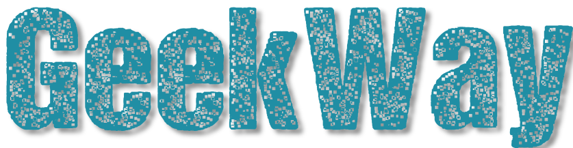

<h3 align="center">
  
</h3>
 <p align="center"> Applications developed during Hackathon   </P>  
<h2>  What was created? </h2>

<p> We are a Web platform that enables, generates experience and professional visibility for young people in the area of information technology.</p>

<h2>  How to use? </h2>
<p> You need to install Java Jdk 12+ </p>

<h2>Technologies</h2>
<p>JHipster, PostgreSql,  ReactJS + Redux, Heroku</p>
<h3> Steps <h3>
<h4> 1. Clone this repository <h4>

```
 $ git clone https://github.com/Geek-Way/core.git
```

<h4> 2. Running the application on your terminal <h4>

```
#install the dependencies and build
$ ./mvnw
#start the server/back-end with webkit
$ npm start
```

 <h2> Results</h2>

<p> Note: gif distorts images and colors </p>
 <h3> Geekway</h3>

 <h3> Pages - Carrer, Courses and Vocational tests</h3>
 <h1>Carrer</h1>

<h1> Courses</h1>

<p>
<h1>Vocational tests</h1>

